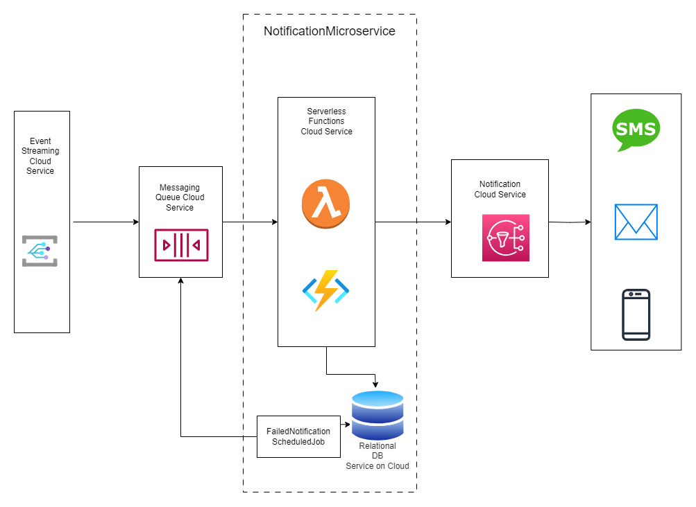

# Capability and Solution Description

The NotificationMicroservice is tasked with providing timely updates to customers regarding any changes within the source system. These updates encompass various aspects, including flight delays, gate changes, and more.

Events which requires system to send a notification such as registration, reservervation updates etc would be pushed onto the Event Streaming Cloud Service. These events will be subscribed by this microservice and will consume those once published to send notifications real-time.

The events will be consumed by a queue. Serverless Lambda Functions will then retrieve these messages from the queue and interface with a cloud-based Notification Service. This Notification Service will send notifications to the user via SMS, email, and push notifications.

Serverless Functions will maintain DB records for the notifications which failed and FailedNotificationScheduledJob will pick those up and push it the queue again.

# Components
- Messaging Queue Cloud Service
- Serverless Functions On Cloud
- FailedNotificationScheduledJob
- Cloud Notification Service
- Relational DB Cloud Service

# Architectural Choice
- Microservice
- Cloud services
- Event Driven Architecture

