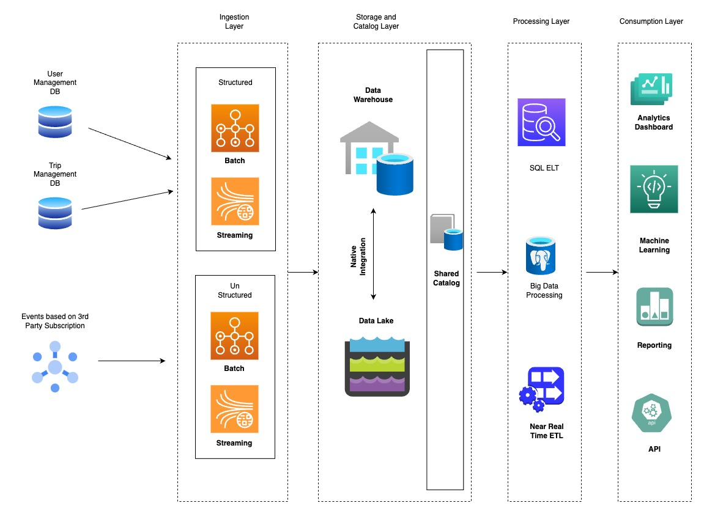

# Capability and Solution Description

Reporting and analytics microservice ingests data from all the different microservices in the Road Warrior landscape as well as events from the third-party applications. The key component of this service is a Lakehouse that provides it the capability to process both structured and unstructured data combining both Data Warehouse and Data Lake capabilities.

# Components
- **Data Sources**: Analytics and Reporting service will consume data from Trip Management , User Management DB and events from third-party integrations.
- **Ingestion Layer**: Ingestion layer will have capabilitites to ingest both structured and unstructured data using streaming and batch processing.
- **Storage and Catalog Layer**: Storage and Catalog layer has both warehouse and lake storage that are nativelty integrated providing the best of both worlds. The data is unified by a shared catalog that helps in organizing, indexing and managing data stored in lakehouse.It provides users and applications with a unified view of the data available in the lakehouse, regardless of whether the data is stored in raw or structured formats. This unified view simplifies data discovery.The catalog supports data governance by allowing organizations to enforce access controls, data retention policies, and data quality standards. It helps organizations maintain data integrity and compliance with regulations.
- **Processing Layer**: Processing layer of the analytics and reporting service contains three components - SQL ELT, Big Data Processing and Near real time ETL.
- **SQL ELT** is a component that enables data transformation using SQL queries, typically performed on structured data. It extracts data from the data lake, loads it into the lakehouse storage, and applies SQL-based transformations to prepare it for analysis, reporting, or downstream processing.SQL ELT provides a familiar SQL interface for data engineers and analysts to transform data, making it suitable for structured data processing tasks in a lakehouse.
- **Big Data Processing** is a component designed for handling large volumes of data, including semi-structured and unstructured data, using distributed processing frameworks like Apache Spark, Hadoop, or Flink. It will allow road warrior to process complex data analytics workloads at scale.This component is essential for processing diverse and high-velocity data streams, performing advanced analytics, and implementing machine learning models on data stored in the lakehouse.
- **Near Real-time ETL** is responsible for ingesting and processing data in near real-time or streaming fashion, enabling organizations to react quickly to data changes and events. It extracts data from various sources, applies transformations, and loads it into the lakehouse for immediate analysis. This component is crucial for scenarios where real-time insights and responsiveness to data events are required, such as event data processing, monitoring, and alerting.
- **Consumption Layer**:
- **Analytics Dashboard**: The Analytics Dashboard is a user-friendly interface that will allow road warrior business analysts and decision-makers to visualize and explore data stored in the lakehouse, making it easy to derive insights and make data-driven decisions.
- **Machine Learning**:The Machine Learning component leverages the data stored in the lakehouse to build and deploy machine learning models for predictive analytics, recommendation systems, and automation of decision-making processes.
- **Reporting**:Reporting tools and capabilities in the consumption layer enable users to generate standardized and ad-hoc reports based on lakehouse data, facilitating data-driven reporting, performance monitoring, and compliance reporting.
**API (Application Programming Interface)**:The API component provides programmatic access to the data and services within the lakehouse, enabling developers to build custom applications, integrations, and automated workflows that utilize the data for various purposes, such as third-party integrations or real-time data access.

# Architectural Choice
- 

