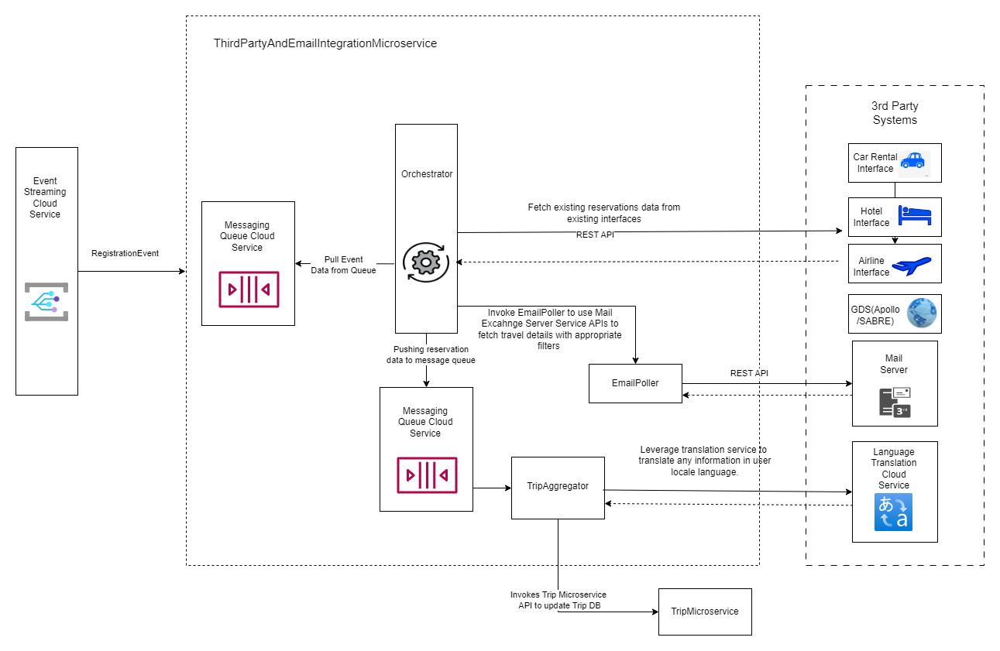
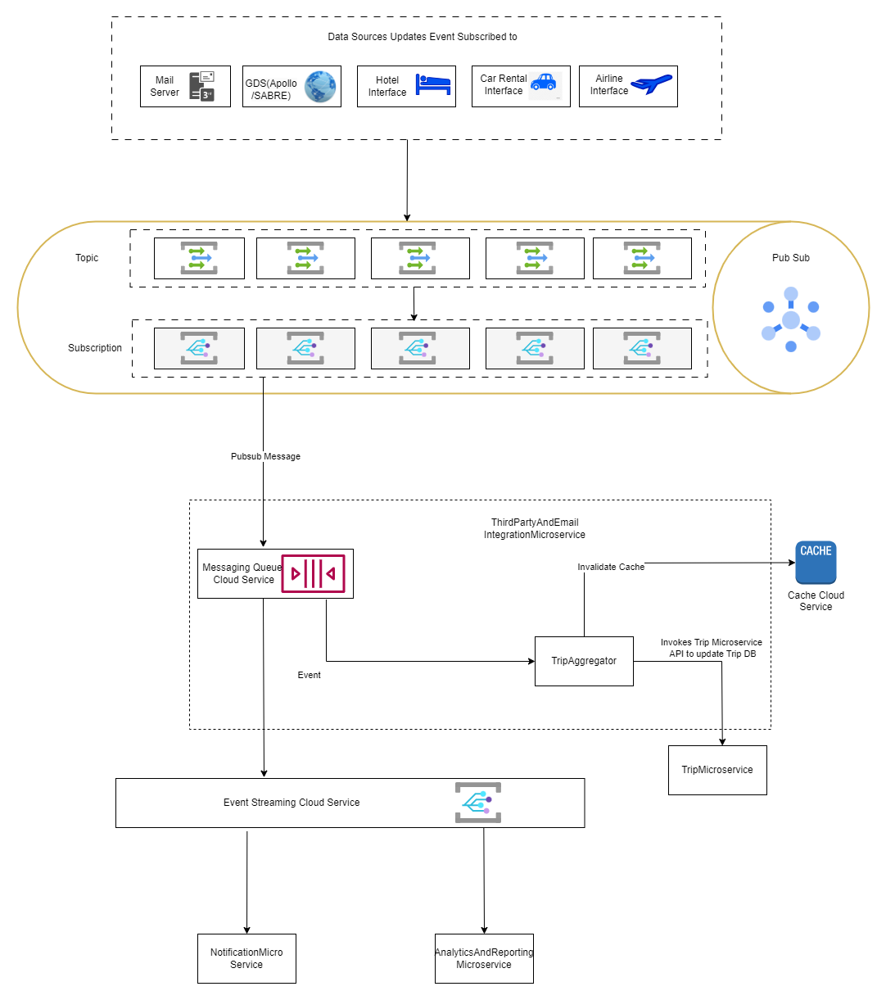

# Capability and Solution Description

As soon as the customer registers, UserManagementMicroservice would push an event onto Event streaming service. The ThirdPartyAndEmailIntegrationMicroservice message queue will consume those events and start teh preparation of the initial setup of user data. The system will notify the user that their data is being synchronized across various systems and will be ready on the dashboard within a few minutes.

The Data Orchestrator picks up the event data from the queue, which in turn communicates with various systems such as GDS (Apollo/SABRE), existing airline, hotel, and car rental interfaces. It also polls whitelisted emails to gather booking details data, applying appropriate filters. This service-based data fetching occurs only during the initial data setup after a user registers. Once the data is fetched, it is moved into a message channel cloud service. A serverless aggregator reads the message groups from the queue and invokes APIs of Trip Microservice to update the trip data for that customer in the NoSQL Cluster on the Cloud. 

# Architectural Characteristics

All mail exchange servers, GDS, and existing interfaces (airline, hotel, and car rental) provide a subscription feature. This feature allows Road Warriors to retrieve updates on changes or updates in the source system based on the subscribed topics. Road Warriors will consume the details received from the source systems and pushing them to a message queue. The TripAggregator will pick up these messages for further processing. Additionally, these updates are sent as complete autonomous events in the Cloud Event Streaming Service. The NotificationService and ReportingAndAnalyticsMicroservice consume these data update events. Such a pubsub model will make sure the data flows into Road Warriors as soon as there is an update in the source system and TripAggregator will invoke TripMicroservice API to update the Trip NoSQL DB.

# Components
- Orchestrator
- EmailPoller
- ExternalDataSources
- Messaging Queue Cloud Service
- TripAggregator
- NoSQL DB Cloud Service
- Cache Cloud Service
- Event Stream Cloud Service

# Architectural Choice
- Microservice
- Publisher/Subscribe Model for updates.
- Service based integration for initial data setup
- Cloud Services

