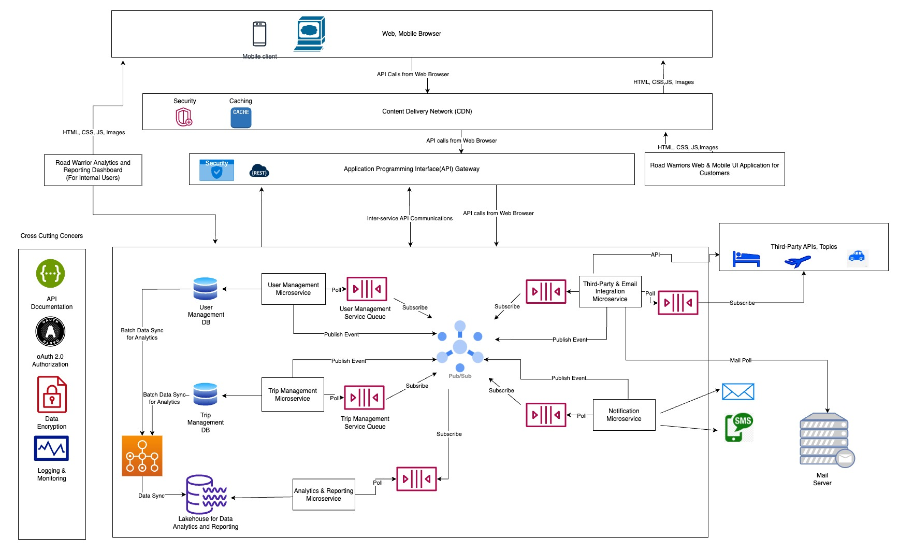

# arch-katas-2023

# The Road Warriors 

## Introduction

### Overview
The Road Warriors is an ambitious project aimed at revolutionizing the way travelers manage their reservations and trips. This innovative platform empowers users to seamlessly organize and access their travel information, providing a comprehensive view of existing reservations with the latest updates on reservations. The goal is to deliver a sophisticated, user-centric interface accessible through both web and mobile devices, enhancing the travel experience for millions of users globally.

Authors:
* [Bala Kolluru](https://www.linkedin.com/in/bala-subramanyam-kolluru-8592728a/)
* [Saurabh Sethia](https://www.linkedin.com/in/saurabh-sethia-13n/)
* [Bala SP](https://www.linkedin.com/in/balasubramanyasp/)
* [Varun Jain](https://www.linkedin.com/in/varun-jain-1654b236/)

### Scope and Objective
The scope of this project encompasses the development of a highly responsive dashboard that aggregates travel reservations, allowing users to manage their trips effortlessly. The system will accommodate 15 million users and sustain an active user base of 2 million per week. It will seamlessly integrate with prominent travel industry interfaces, including SABRE and APOLLO, ensuring real-time updates on travel details. The dashboard will provide a visually engaging, user-friendly interface across all platforms. Additionally, it will offer end-of-year summary reports, revealing insightful metrics about travel usage.

This document outlines the architectural, design, performance, integration, and security considerations that will shape the development and deployment of the Road Warriors Dashboard. By adhering to these guidelines, we aim to create a reliable, high-performance, and user-friendly platform that significantly elevates the travel experience for millions of users.

### Business Requirements  

#### Create an Online Trip Management Dashboard:
Develop a web-based application to facilitate trip management, allowing users to organize and oversee their travel plans effectively.

#### User Scalability:
Ensure the system can support a minimum of 2 million active users per week and a total user capacity of up to 15 million.

#### Email Integration:
Implement a feature to scan emails for travel-related information, filtering and whitelisting specific emails for relevant trip updates.

#### Seamless Integration with GDS Systems:
Ensure seamless integration with existing travel systems, such as SABRE and APOLLO, for enhanced functionality and information retrieval.

#### Integration with Travel Systems:
Integrate the system with the agency's existing airline, hotel, and car rental interface systems to provide real-time updates on travel details such as delays, cancellations, gate changes, etc., within 5 minutes of occurrence.

#### User-Controlled Reservations:
Allow users to add, update, or delete existing reservations manually, giving them full control over their travel plans.

#### Trip-Based Organization:
Enable users to group dashboard items by trip, automatically removing items once a trip is completed for efficient organization.

#### Trip Information Sharing:
Provide functionality for users to share trip information through standard social media platforms or with specific individuals.

#### User Interface Excellence:
Design a highly intuitive and visually engaging user interface accessible across all deployment platforms.

#### Summary Reports:
Generate comprehensive end-of-year summary reports for users, encompassing various travel usage metrics.

#### Analytical Data Gathering:
Collect analytical data from users' trips, including travel trends, location preferences, vendor choices, cancellation rates, and other relevant insights.

#### Integration with Travel Agency:
Integrate with the preferred travel agency to facilitate rapid issue resolution and enhance customer support.

#### International Functionality:
Ensure the system operates seamlessly on an international scale to accommodate users traveling worldwide.

#### System Availability:
Guarantee uninterrupted access to the system, with a maximum of 5 minutes of unplanned downtime per month.

#### Timely Travel Updates:
Display travel updates within the application promptly, aiming for a maximum delay of 5 minutes from the time of generation.

#### Optimized Response Time:
Achieve a web response time of 800ms and a mobile first-contentful paint time of under 1.4 seconds to enhance user experience and engagement.

# Architecture

##  Strategy

In order to meet the stringent requirements of supporting 2 million active users per week and a total of 15 million users, our architectural approach centers around leveraging the power of Microservices, Cloud-based Services and an Event Driven Architecture. This strategy is fundamental to achieving the desired scalability, availability, and overall efficiency of the Road Warrior application.
On the front-end application our approach is go with a responsive web app for MVP and then move to native mobile App for subsequent releases as this helps in faster time to market, saves budget and provides road warriors an opportunity to test the product with one channel.

### Key Benefits of the Strategy
Scalability: Microservices and cloud based services enable seamless scaling of individual components, allowing us to handle the anticipated user base and growth without over-provisioning resources.

#### Resilience and Availability: 
Event-Driven Architecture enhances system resilience by allowing services to independently react to events, reducing dependencies and potential failure points. Combined with cloud-based services, this ensures high availability, fault tolerance, and disaster recovery capabilities.

#### Flexibility and Agility: 
The combination of microservices and the cloud grants us the agility to update, deploy, and manage services independently, facilitating faster development cycles and adaptability to evolving requirements.

#### Cost-Efficiency: 
By leveraging cloud resources, we optimize costs through efficient resource allocation, paying only for what we use, and avoiding unnecessary infrastructure investments.

This strategic approach aligns with the project's objectives and forms the foundation of our architectural design. It positions us to efficiently accommodate the targeted user base while providing a highly available and responsive Road Warrior Dashboard.

## Assumptions

- Road Warrior is not a booking agency. It provides the dashboard and notifications to the users.
- System will collect user's identity information like Passport Number, any local identifiers that can be used to fetch the trip information.
- System will only show future events.
- All data sources support Pub/Sub model for updates and Road Warriors will subscribe to those updates to get real time updates.

## The Architecture  

* [General Architecture]()

 

  
* **Architecture Components**:
* **Content Delivery Network(CDN)** : Content Delivery Network (CDN) accelerates content delivery by caching and distributing assets like images and static files to geographically dispersed servers. This reduces latency, enhances user experience, and ensures fast loading times for travelers accessing the app from various locations.In addition to performance benefits, a CDN for the Road Warrior App also enhances security by providing DDoS protection, web application firewalls, and SSL/TLS encryption, safeguarding user data and preventing malicious attacks at the network edge.
* **API Gateway** : API Gateway serves as a central entry point, managing and routing all external and internal API requests. It streamlines communication, enforces security measures, and provides load balancing, ensuring efficient and secure interactions between microservices while simplifying access for clients.
* **Microservices**: Application is divided into following microservices:
   * **User Management Microservice** :
    Manages user profiles, authentication, and preferences, ensuring secure access and personalization for travelers.
    Database: Stores user data for authentication and customization.
   * **Trip Management Microservice**:
    Organizes and updates trip reservations, enabling travelers to view and manage their itineraries seamlessly.
    Database: Manages trip data, including reservations, trip details, and user associations.
   * **Third-Party and Email Integrations Microservice**:
    Interfaces with airlines, hotels, and car rental systems to provide real-time updates and sync travel details.
    Polls and subscribes to email updates to scan travel related mails.
    Subscribes to regular updates from 3rd party systems through a queue and publishes the updates to topic that is fan out to all the other microservice queues for updates.
   * **Notification Microservice** :
    Handles user notifications, allowing customization of alerts and updates for travelers.
    Supports SMS, Email and Push notifications.
   * **Reporting & Analytics Microservice**:
    Generates end-of-year summary reports with various travel metrics and insights for users.
    Gathers analytical data from trips to provide insights, trends, and end-of-year summary reports for users.
    Lakehouse: Syncs data in batch mode from Travel and User Management databases. Also consumes events from third-party integration service.

* **Microservices Communication Patterns** :
   * **API based**: Microservices can communicate with each other over REST API for any synchronous communication needs.
   * **Publish-Subscribe**: Microservices will utilize Pub/Sub communication for any asynchronous communication needs.For example as soon as a user registers, user management                                 service can publish a user registereted event that will notify the third-party integration service to collect data for the user to setup the dashboard.
   * **Batch Processing**: Microservices will trigger batch jobs or long-running processes asynchronously. For example, analytics and reporting service will sync data using a                                batch process from user management and trip management databases.
    
   * **WebSockets for Real-Time Communication**: Microservices will utilize bidirectional,persistent connection for real-time updates and interactive features. This can be                                                         utilized to trigger any critical travel updates to user's dashboard.
* **Cross Cutting Concerns**:
    * **API Contracts and Documentation**: Application will maintain API contracts and documentation using tools like OpenAPI (Swagger), GraphQL schemas.
    * **API Versioning**: Application will implement versioning for the APIs to ensure backward compatibility when making changes and will avoid breaking changes that can disrupt                           communication between services.
    * **Authentication and Authorization**: Application will ensure that interservice API calls are secure by implementing proper authentication and authorization mechanisms.                                                 OAuth 2.0 or token-based authentication will be used.It will define access control policies to restrict access to specific endpoints                                               or actions.
    * **Monitoring and Logging**: Application will implement robust monitoring and logging for API calls to track performance, errors, and usage patterns. It will use centralized                                   logging and monitoring tools to gain insights into your microservices architecture.
    * **Data Encryption** : Application will encrypt all data at rest using encryption mechanisms supported by database solutions  and in-transit using HTTPS protocol.
                           Application will taken utmost care in dealing with any PII or sensitive data and will adhere to all local compliances like GDPR,CCPA etc.
    
#### Individual Microservies Capabilities  

* [TripMicroservice](./IndividualMicroservices/TripMicroservice.md)
* [NotificationMicroservice](./IndividualMicroservices/NotificationMicroservice.md)
* [UserManagementMicroservice](./IndividualMicroservices/UserManagementMicroservice.md)  
* [ThirdPartyAndEmailIntegrationMicroservice](./IndividualMicroservices/ThirdPartyAndEmailIntegrationMicroservice.md)
* [ReportingAndAnalyticsMicroservice](./IndividualMicroservices/ReportingAndAnalyticsMicroservice.md)

## Architectural Desision Records (ADRs)  

You can find the key Architectural Decision Records [here](./ADR/)  
